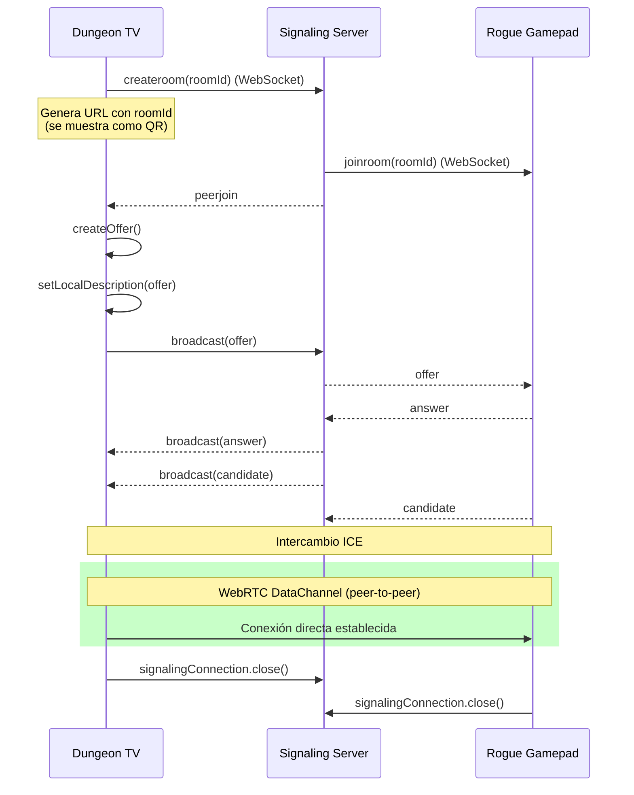
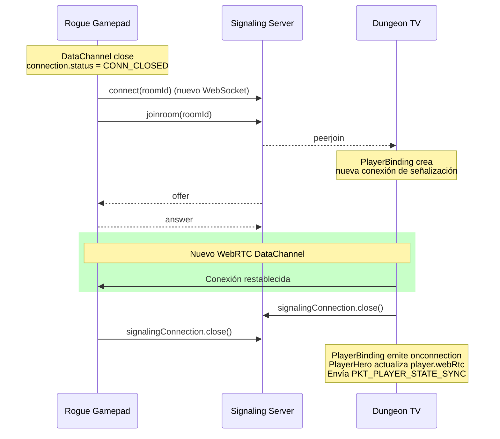

# Especificación de Conexiones y Reconexiones

## 1. Arquitectura General

El sistema de conexión se compone de tres partes:

- **Signaling Server** (`gamepad/v1/signaling-server/index.js`): Servidor WebSocket que gestiona salas (rooms) para el intercambio de señalización WebRTC.
- **Dungeon TV** (`dungeon-tv`): Aplicación principal que actúa como host. Crea la sala de señalización, genera la URL QR para que los gamepads se conecten, y gestiona la lógica de juego.
- **Rogue Gamepad** (`rogue-gamepad`): Aplicación cliente que actúa como mando. Se conecta a una sala de señalización y establece una conexión WebRTC peer-to-peer con Dungeon TV.

### 1.1 Diagrama de flujo de conexión inicial



### 1.2 Tipos de conexión

- **Conexión de señalización (WebSocket)**: Se usa únicamente para el intercambio inicial de señalización WebRTC (offers, answers, ICE candidates). Una vez establecido el DataChannel (`onOpen`), la conexión WebSocket **se cierra inmediatamente** y el objeto `SignalingConnection` se desecha. Para cualquier reconexión posterior, se crea una instancia de señalización completamente nueva.
- **Conexión de datos (WebRTC DataChannel)**: Canal peer-to-peer directo por el que viajan todos los paquetes del juego. Es la conexión principal.

---

## 2. Definiciones de Tipos

### 2.1 `IPlayerConnection` (Dungeon TV)

```typescript
export interface IPlayerConnection {
  playerId: string
  webRtc: WebRtcHandle
  isWaiting: boolean
  isReady: boolean
  isConnected: boolean
  actor: IPlayer
}
```

| Campo         | Descripción                                                                                               |
| ------------- | --------------------------------------------------------------------------------------------------------- |
| `playerId`    | Identificador único del jugador (UUID generado por Dungeon TV).                                           |
| `webRtc`      | Objeto que contiene las referencias a la conexión WebRTC activa.                                          |
| `isWaiting`   | `true` cuando el jugador ha enviado su configuración aceptada y está esperando a que la partida comience. |
| `isReady`     | `true` cuando el jugador ha indicado que está listo para empezar.                                         |
| `isConnected` | `true` mientras el DataChannel está abierto. Se pone a `false` cuando se cierra.                          |
| `actor`       | Objeto `IPlayer` que representa al personaje del jugador en el juego.                                     |

### 2.2 `IPlayer` (Dungeon TV)

```typescript
interface IPlayer extends ICharacter {
  type: "player"
  sprite: RogueName
}
```

Hereda de `ICharacter`:

```typescript
interface ICharacter {
  id: string
  isAlive: boolean
  name: string
  position: Vec2
  offset: Vec2
  sounds: CharacterSounds
  baseStats: CharacterStats
  totalStats: CharacterStats
  currentStats: CharacterStats
  traits: Item[]
  items: Item[]
}
```

### 2.3 `WebRtcHandle` (Dungeon TV)

```typescript
export interface WebRtcHandle {
  peerConnection: RTCPeerConnection
  dataChannel: RTCDataChannel
}
```

### 2.4 `WebRtcCallbacks` (Dungeon TV)

```typescript
export interface WebRtcCallbacks {
  onPeerjoin: () => void
  onOpen: (handle: WebRtcHandle) => void
  onDisconnected: () => void
  onGamepadUrl: (url: string) => void
}
```

### 2.5 `ConnStatus` (Rogue Gamepad)

```typescript
type ConnStatus = "CONN_CLOSED" | "CONN_OPENNING" | "CONN_OPEN" | "CONN_ERROR"
```

### 2.6 `SignalingConnection` (compartido)

```typescript
class SignalingConnection {
  constructor(serverUrl: string)
  connect(): Promise<void>
  disconnect(): void
  createRoom(roomId: string): Promise<void> // Dungeon TV
  joinRoom(roomId: string): void // Rogue Gamepad
  sendOffer(offer: RTCSessionDescriptionInit): void
  sendAnswer(answer: RTCSessionDescriptionInit): void
  sendCandidate(candidate: RTCIceCandidate): void
  on(eventName: EventName, handler: EventHandler): () => void
}
```

Eventos disponibles: `"peerjoin"`, `"peerclose"`, `"candidate"`, `"answer"`, `"offer"`, `"disconnect"`.

---

## 3. Flujo de Conexión

### 3.1 Creación de la sala (Dungeon TV)

1. **Landing.svelte** genera un `playerId` con `crypto.randomUUID()`.
2. Renderiza **PlayerConnection.svelte** pasándole el `playerId`.
3. **PlayerConnection.svelte** utiliza internamente **PlayerBinding.svelte**.
4. **PlayerBinding.svelte** en `onMount` llama a `setupWebRtcConnection(playerId, callbacks)`.
5. **setupWebRtcConnection** (en `webrtc.ts`):
   - Crea una `SignalingConnection` efímera y se conecta al servidor WebSocket.
   - Llama a `signalingConnection.createRoom(playerId)`.
   - Genera la URL del gamepad: `VITE_GAMEPAD_URL?r=<playerId>`.
   - Llama a `callbacks.onGamepadUrl(url)` para mostrar el QR.
   - Espera el evento `"peerjoin"` del signaling server.
   - Cuando recibe `"peerjoin"`, ejecuta `initSignaling()` que crea el `RTCPeerConnection` y el `RTCDataChannel`.
   - Una vez que el DataChannel se abre (`open`):
     - **Cierra inmediatamente la conexión de señalización**.
     - Llama a `callbacks.onOpen(handle)`.

### 3.2 Conexión del gamepad (Rogue Gamepad)

1. **App.svelte** extrae el `roomId` del query parameter `?r=` de la URL.
2. Llama a `connect(roomId)`.
3. **connect()** (en `connection.svelte.ts`):
   - Crea una `SignalingConnection` y se conecta al WebSocket.
   - Llama a `signalingConnection.joinRoom(roomId)`.
   - El signaling server emite `"peerjoin"` al creador de la sala (Dungeon TV).
   - Escucha el evento `"offer"`.
4. Al recibir la `offer`:
   - Crea un `RTCPeerConnection` con los ICE servers.
   - Escucha `icecandidate` para enviar candidatos.
   - Escucha `iceconnectionstatechange` para detectar desconexiones.
   - Escucha el evento `datachannel` en the peer connection.
   - Configura los handlers del DataChannel (message, open, close, error).
   - Establece `setRemoteDescription(offer)`.
   - Crea y envía una `answer`.
5. Cuando el DataChannel se abre:
   - Cierra la conexión de señalización (`signalingConnection.disconnect()`).
   - Establece `connection.status = CONN_OPEN`.

### 3.3 Finalización de la conexión (Dungeon TV)

Cuando el DataChannel se abre en Dungeon TV, **PlayerBinding.svelte** emite un evento `onconnection` con un objeto `WebRtcHandle`. La conexión de señalización ya ha sido cerrada en este punto.

**Importante**: Cada vez que se recibe una nueva conexión (ya sea nueva o reconexión), se debe llamar a `setupPlayerConnection(player)` para vincular los listeners del DataChannel (`message`, `close`) al nuevo canal.

#### En PlayerConnection.svelte (Landing):

1. Recibe el `WebRtcHandle` de `PlayerBinding.svelte`.
2. Filtra `gameState.players` para eliminar cualquier entrada previa con el mismo `playerId`.
3. Construye el objeto `IPlayerConnection`:
   - `playerId`, `isReady = false`, `isConnected = true`.
   - Crea un `actor` con `createPlayerActor(playerId, "dwarf", "male")`.
   - Asigna el `webRtc` handle.
4. Llama a `setupPlayerConnection(conn)` para configurar los handlers de paquetes.
5. Añade `conn` a `gameState.players`.
6. Emite un evento `connection` hacia **Landing.svelte**.
7. **Landing.svelte** recibe el evento y genera un nuevo `playerId` para el siguiente binding.

#### En PlayerHero.svelte (In-game):

1. Si el jugador se desconecta, **PlayerHero.svelte** detecta `!player.isConnected` y renderiza **PlayerBinding.svelte**.
2. Al obtener una nueva conexión (`onconnection`):
   - Actualiza la propiedad `webRtc` del objeto `player` existente.
   - Pone `player.isConnected = true`.
   - Llama a `setupPlayerConnection(player)` para re-vincular los listeners al nuevo DataChannel.
   - Envía `PKT_PLAYER_STATE_SYNC` para sincronizar el estado.
3. El objeto `player` mantiene su `actor` y estado previo, recuperando la conectividad.

---

## 4. Flujo de Desconexión

### 4.1 Detección de desconexión

La desconexión se detecta en Dungeon TV a través de dos mecanismos:

1. **Evento `iceconnectionstatechange`** en el `RTCPeerConnection`:

   ```typescript
   peerConnection.addEventListener("iceconnectionstatechange", () => {
     const state = peerConnection.iceConnectionState
     if (state === "disconnected" || state === "failed") {
       handleDisconnected()
     }
   })
   ```

2. **Evento `close`** en el `RTCDataChannel`:
   ```typescript
   dataChannel.addEventListener("close", () => {
     handleDisconnected()
   })
   ```

Ambos llaman a `handleDisconnected()` que ejecuta `callbacks.onDisconnected()`.

### 4.2 Manejo de desconexión en PlayerBinding

```typescript
onDisconnected() {
  if (gameState.stage === null) {
    // Si la partida NO ha comenzado, elimina al jugador
    const conn = connection as IPlayerConnection
    if (conn.playerId) {
      gameState.players = gameState.players.filter(
        (p) => p.playerId !== conn.playerId,
      )
    }
  }
  // Vuelve al estado WAITING_PLAYER para permitir reconexión
  componentState.set("WAITING_PLAYER")
}
```

**Regla**: Si la partida no ha comenzado (`gameState.stage === null`), el jugador se elimina de la lista. Si la partida ya comenzó, el jugador permanece en `gameState.players` pero con `isConnected = false`.

### 4.3 Manejo de desconexión en connections.ts

Cuando el DataChannel se cierra, el handler en `setupPlayerConnection` se ejecuta:

```typescript
export function setupPlayerConnection(conn: IPlayerConnection): void {
  conn.webRtc.dataChannel.addEventListener("message", (event: MessageEvent) => {
    const pkt = new Uint8Array(event.data)
    // ... handlers ...
  })

  conn.webRtc.dataChannel.addEventListener("close", () => {
    conn.isConnected = false
    // ... lógica de pasar turno ...
  })
}
```

**Reglas**:

- `isConnected` se pone a `false`, pero el objeto `IPlayerConnection` permanece en `gameState.players`.
- Si el jugador desconectado tenía el turno y la partida está en curso, el turno pasa automáticamente al siguiente jugador conectado.
- Si no hay jugadores conectados, no se hace nada (la partida queda en pausa implícita).

### 4.4 Manejo de desconexión en Rogue Gamepad

En el gamepad, cuando se detecta una desconexión (DataChannel close o ICE disconnected/failed):

```typescript
// En connection.svelte.ts
dataChannel.addEventListener("close", () => {
  connection.status = CONN_CLOSED
  clearConnection()
})

peerConnection.addEventListener("iceconnectionstatechange", () => {
  if (state === "disconnected" || state === "failed") {
    connection.status = CONN_CLOSED
    clearConnection()
  }
})
```

Y en **App.svelte**, un `$effect` monitoriza el estado y reintenta la conexión automáticamente:

```typescript
$effect(() => {
  if (connection.status === CONN_CLOSED && roomId) {
    const timer = setTimeout(() => connect(roomId!), 1000)
    return () => clearTimeout(timer)
  }
})
```

---

## 5. Flujo de Reconexión

### 5.1 Visión general

La reconexión sigue el mismo flujo que la conexión inicial, con la diferencia de que el `playerId` ya existe en el sistema. El diseño actual permite la reconexión porque:

1. **Rogue Gamepad** reintenta la conexión automáticamente cuando detecta `CONN_CLOSED`.
2. **PlayerHero.svelte** vuelve a renderizar **PlayerBinding.svelte** tras una desconexión, mostrando de nuevo el QR con la misma URL (que contiene el mismo `playerId`).
3. **PlayerBinding.svelte** crea una nueva conexión de señalización limpia en cada montaje, evitando estados residuales de conexiones previas.

### 5.2 Flujo detallado de reconexión



### 5.3 El sistema `activeHandles` en webrtc.ts

```typescript
const activeHandles = new Map<
  string,
  {
    handle: WebRtcHandle
    signalingConnection: SignalingConnection
    callbacks: WebRtcCallbacks
    initSignaling: () => void
    disconnected: boolean
  }
>()
```

Cuando `setupWebRtcConnection` se llama con un `playerId` que ya existe en `activeHandles`:

```typescript
export async function setupWebRtcConnection(
  playerId: string,
  callbacks: WebRtcCallbacks,
): Promise<WebRtcHandle> {
  const existing = activeHandles.get(playerId)
  if (existing) {
    existing.callbacks = callbacks
    existing.disconnected = false
    return existing.handle
  }
  // ... crear nuevo handle
}
```

**Importante**: Actualmente el sistema `activeHandles` solo reutiliza la conexión de señalización existente. Cuando un gamepad se reconecta, el signaling server emite `"peerjoin"` de nuevo, lo que dispara `initSignaling()` y crea un nuevo `RTCPeerConnection` y `RTCDataChannel`. Esto significa que la reconexión establece un canal completamente nuevo.

### 5.4 Comportamiento según el estado de la partida

#### Si la partida NO ha comenzado (`gameState.stage === null`):

1. El gamepad se desconecta.
2. `onDisconnected` en PlayerBinding elimina al jugador de `gameState.players`.
3. PlayerBinding vuelve a `WAITING_PLAYER` y muestra el QR.
4. El gamepad reconecta automáticamente (reintento en App.svelte).
5. El gamepad vuelve a pasar por el flujo de configuración de personaje.

#### Si la partida está en curso (`gameState.stage !== null`):

1. El gamepad se desconecta.
2. `PlayerHero.svelte` detecta `!player.isConnected` y renderiza `PlayerBinding.svelte`.
3. El handler de `close` del DataChannel en `connections.ts`:
   - Pone `conn.isConnected = false`.
   - Si el jugador tenía el turno, pasa al siguiente.
4. `PlayerBinding.svelte` muestra el QR.
5. El gamepad reconecta automáticamente.
6. Cuando `onOpen` se dispara en `PlayerBinding.svelte`:
   - Emite `onconnection(webRtcHandle)`.
   - `PlayerHero.svelte` recibe el handle y actualiza `player.webRtc = webRtcHandle`.
   - `player.isConnected` se pone a `true`.
   - Llama a `setupPlayerConnection(player)` para re-vincular los listeners.
   - Se envía `PKT_PLAYER_STATE_SYNC` para restaurar el estado del personaje.
7. El jugador reconectado espera a que llegue su turno en el orden habitual.

### 5.5 Caso especial: jugador único reconectando

Si el jugador desconectado es el único jugador en la partida:

- Cuando se desconecta, `connectedPlayers.length === 0`, por lo que no se pasa el turno (no hay a quién pasarlo).
- Cuando reconecta, el `onOpen` crea un nuevo `IPlayerConnection` y lo añade a `gameState.players`.
- **Comportamiento actual**: El jugador reconectado se queda esperando su turno. Como es el único jugador, `nextAlivePlayerIndex()` en `game.ts` lo encontrará y se activará su turno en la siguiente iteración del ciclo de juego.
- **Comportamiento deseado (según requisitos)**: Si es el único jugador, su turno debería activarse inmediatamente al reconectar. Esto requiere una implementación adicional.

---

## 6. Paquetes del Protocolo

Todos los paquetes viajan por el RTCDataChannel como `Uint8Array`. El primer byte (`pkt[0]`) identifica el tipo de paquete.

| ID  | Constante               | Descripción                                                               |
| --- | ----------------------- | ------------------------------------------------------------------------- |
| 1   | `PKT_GAMEPAD_STATE`     | Estado del mando (joystick y botones). Enviado por el gamepad.            |
| 2   | `PKT_MENU`              | Acción de menú.                                                           |
| 3   | `PKT_PLAYER_CONFIG`     | Configuración de estadísticas del personaje. Enviado por el gamepad.      |
| 4   | `PKT_PLAYER_ACCEPT`     | El jugador acepta su configuración. Enviado por el gamepad.               |
| 5   | `PKT_PLAYER_READY`      | El jugador indica que está listo. Enviado por el gamepad.                 |
| 6   | `PKT_GAME_START`        | La partida ha comenzado. Enviado por Dungeon TV.                          |
| 7   | `PKT_ENABLE_TURN`       | Activa el turno del jugador. Enviado por Dungeon TV.                      |
| 8   | `PKT_DISABLE_TURN`      | Desactiva el turno del jugador. Enviado por Dungeon TV.                   |
| 9   | `PKT_NEXT_PLAYER`       | Solicitud de pasar al siguiente turno. Enviado por el gamepad.            |
| 10  | `PKT_PLAYER_HEALTH`     | Actualización de salud del jugador. Enviado por Dungeon TV.               |
| 11  | `PKT_PLAYER_STATE_SYNC` | Sincronización completa del estado del personaje. Enviado por Dungeon TV. |

### 6.1 PKT_PLAYER_STATE_SYNC (ID 11)

Se envía desde Dungeon TV al gamepad cuando un jugador reconecta, para restaurar el estado de su personaje.

**Estructura**:

```
[PKT_PLAYER_STATE_SYNC, JSON_string_bytes...]
```

El JSON contiene:

```typescript
{
  sprite: RogueName
  name: string
  genre: "male" | "female"
  health: number
  maxHealth: number
  movement: number
  actions: number
  attack: number
  defence: number
  aim: number
  magic: number
}
```

---

## 7. Gestión de Turnos

### 7.1 Flujo normal de turnos

1. Dungeon TV envía `PKT_ENABLE_TURN` al jugador actual.
2. El gamepad recibe el paquete y establece `globalState.myTurn = true`.
3. El jugador interactúa con el gamepad y envía `PKT_GAMEPAD_STATE`.
4. Cuando el jugador pulsa "Next", se envía `PKT_NEXT_PLAYER`.
5. Dungeon TV recibe `PKT_NEXT_PLAYER`:
   - Envía `PKT_DISABLE_TURN` al jugador actual.
   - Llama a `nextPlayer()` que busca el siguiente jugador vivo y conectado.
   - Envía `PKT_ENABLE_TURN` al nuevo jugador actual.

### 7.2 Función `nextAlivePlayerIndex()` en game.ts

```typescript
function nextAlivePlayerIndex(): number {
  const players = gameState.players
  const nextIndex = gameState.playerIndex + 1

  const priorized = [
    ...players.slice(nextIndex),
    ...players.slice(0, nextIndex),
  ]

  const next = priorized.findIndex((player) => {
    return player.actor.isAlive && player.isConnected
  })

  if (next === -1) return -1

  return (nextIndex + next) % players.length
}
```

**Reglas de selección del siguiente jugador**:

- Solo se consideran jugadores con `actor.isAlive === true`.
- Solo se consideran jugadores con `isConnected === true`.
- Los jugadores desconectados (`isConnected === false`) son saltados.
- Si no hay jugadores vivos y conectados, devuelve `-1`.

---

## 8. Reglas de Comportamiento (Resumen)

| #   | Regla                                                                                                                   | Estado                      |
| --- | ----------------------------------------------------------------------------------------------------------------------- | --------------------------- |
| 1   | Los jugadores se conectan mediante WebRTC usando un signaling server WebSocket intermedio.                              | ✅ Implementado             |
| 2   | Un jugador puede reconectar usando el mismo `playerId`.                                                                 | ✅ Implementado             |
| 3   | La reconexión funciona tanto en partida individual como multijugador.                                                   | ✅ Implementado             |
| 4   | Cuando un jugador se desconecta teniendo el turno, el turno pasa automáticamente al siguiente jugador conectado.        | ✅ Implementado             |
| 5   | Cuando un jugador está desconectado, su `IPlayerConnection` permanece en `gameState.players` con `isConnected = false`. | ✅ Implementado             |
| 6   | El avatar de un jugador desconectado no se ve en el mapa (se salta en `nextAlivePlayerIndex`).                          | ✅ Implementado             |
| 7   | Si un jugador reconecta, espera a que llegue su turno en el orden habitual.                                             | ✅ Implementado             |
| 8   | Si el jugador reconectado es el único jugador, su turno se activa inmediatamente.                                       | ❌ Pendiente de implementar |
| 9   | El objeto `IPlayerConnection` se crea en `PlayerConnection.svelte` (Landing).                                           | ✅ Implementado             |
| 10  | `PlayerHero.svelte` reutiliza el objeto `IPlayerConnection` actualizando solo su `webRtc`.                              | ✅ Implementado             |
| 11  | `PlayerBinding.svelte` es un componente agnóstico que solo gestiona la conexión WebRTC.                                 | ✅ Implementado             |

---

## 9. Puntos de Extensión y Mejoras

### 9.1 Activación inmediata de turno para jugador único

Actualmente, cuando un jugador único reconecta, no se activa su turno automáticamente. Para implementarlo, se podría añadir una verificación en el callback de reconexión de `PlayerHero.svelte`:

```typescript
function onconnection(webRtcHandle: WebRtcHandle) {
  player.webRtc = webRtcHandle
  player.isConnected = true

  // Si es el único jugador, activar turno inmediatamente
  const connectedPlayers = gameState.players.filter((p) => p.isConnected)
  const isOnlyPlayer = connectedPlayers.length === 1
  const isThisPlayersTurn =
    gameState.currentPlayer?.playerId === player.playerId

  if (gameState.stage && isOnlyPlayer && isThisPlayersTurn) {
    const enableTurnPkt = new Uint8Array([PKT_ENABLE_TURN])
    player.webRtc.dataChannel.send(enableTurnPkt)
  }
}
```

### 9.2 Timeout de reconexión

Actualmente el gamepad reintenta la conexión cada segundo indefinidamente. Se podría añadir un número máximo de reintentos o un backoff exponencial.

### 9.3 Sincronización de estado al reconectar

Cuando un jugador reconecta en medio de una partida, se envía `PKT_PLAYER_STATE_SYNC` para restaurar su personaje. Actualmente esto se hace desde `webrtc.ts` mediante `sendPlayerStateSync`. Habría que asegurarse de que también se sincronice:

- Posición actual en el mapa.
- Items en el inventario.
- Estado de la niebla de guerra (si aplica).

### 9.5 Manejo de `peerclose` del signaling server

Cuando un WebSocket se cierra, el signaling server emite `"peerclose"` a los demás peers en la sala. Actualmente Dungeon TV no maneja este evento explícitamente. Podría usarse como una señal adicional de desconexión.

---

## 10. Referencias

| Archivo                                             | Propósito                                                                   |
| --------------------------------------------------- | --------------------------------------------------------------------------- |
| `dungeon-tv/src/lib/PlayerBinding.svelte`           | Componente base de conexión. Emite `onconnection(WebRtcHandle)`.            |
| `dungeon-tv/src/lib/PlayerConnection.svelte`        | Gestiona la creación de nuevos jugadores (`IPlayerConnection`).             |
| `dungeon-tv/src/lib/Landing.svelte`                 | Renderiza `PlayerConnection` y gestiona la creación de `playerId`.          |
| `dungeon-tv/src/lib/PlayerHero.svelte`              | Gestiona la reconexión de jugadores en partida usando `PlayerBinding`.      |
| `dungeon-tv/src/lib/helpers/webrtc.ts`              | Lógica de WebRTC: creación de ofertas, ICE, DataChannel, y `activeHandles`. |
| `dungeon-tv/src/lib/helpers/connections.ts`         | Handlers de paquetes del DataChannel y lógica de desconexión.               |
| `dungeon-tv/src/lib/helpers/game.ts`                | Gestión de turnos: `nextPlayer()` y `nextAlivePlayerIndex()`.               |
| `dungeon-tv/src/lib/helpers/SignalingConnection.ts` | Cliente WebSocket para el signaling server.                                 |
| `dungeon-tv/src/lib/state.svelte.ts`                | Estado global del juego (`gameState`).                                      |
| `dungeon-tv/src/lib/types.d.ts`                     | Definiciones de tipos (`IPlayerConnection`, `IPlayer`, etc.).               |
| `rogue-gamepad/src/App.svelte`                      | Punto de entrada del gamepad. Conecta y reintenta automáticamente.          |
| `rogue-gamepad/src/lib/connection.svelte.ts`        | Lógica de conexión WebRTC del gamepad.                                      |
| `rogue-gamepad/src/lib/SignalingConnection.ts`      | Cliente WebSocket para el signaling server (gamepad).                       |
| `signaling-server/index.js`                         | Servidor WebSocket de señalización.                                         |
